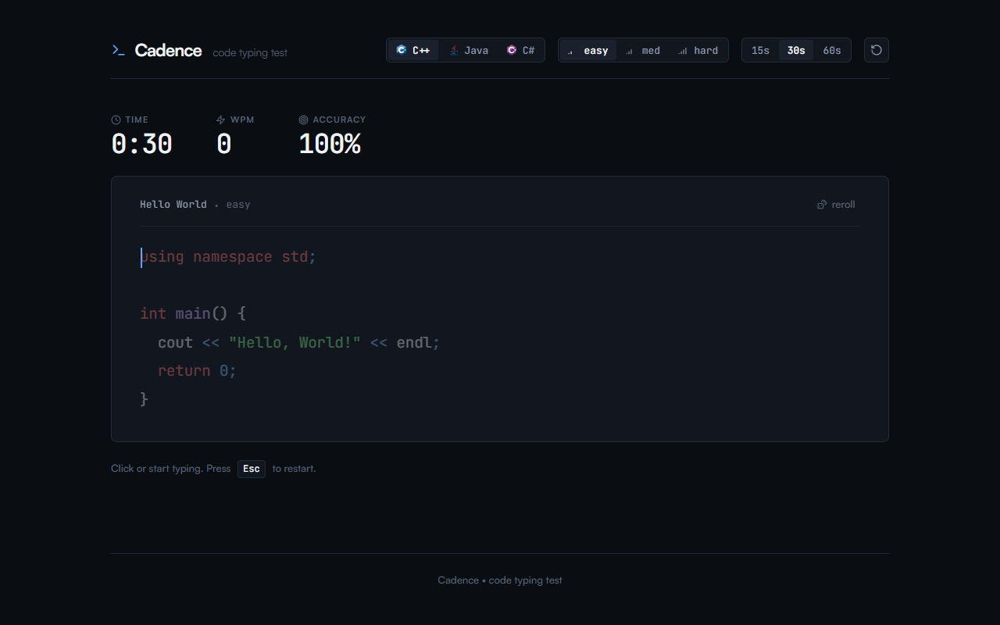

<div align="center">

<p align="center">
  
</p>

# Cadence

A minimalist code typing speed test for developers.

<p align="center">
  <a href="https://github.com/JunaidIRF/Cadence/actions/workflows/ci.yml"></a>
  <a href="https://github.com/JunaidIRF/Cadence"></a>
  <a href="https://junaidirf.github.io/Cadence/"></a>
  <a href="https://github.com/JunaidIRF/Cadence/blob/main/LICENSE"></a>
</p>

<p align="center">
  <a href="https://skillicons.dev">
    
  </a>
</p>

</div>

---

<p align="center">
  
</p>

## Features

- **Language Support** - Authentic code snippets in C++, Java, and C#.
- **Difficulty Tiers** - Easy, Medium, and Hard snippets with on-demand reroll.
- **Live HUD** - Real-time WPM, accuracy, and countdown timer.
- **Syntax Highlighting** - Character-by-character syntax coloring with instant mistype feedback.
- **Tab Key Handling** - Native code indentation without losing focus.

## Getting Started

Clone the repository and open `index.html` in any modern browser:

```bash
git clone https://github.com/JunaidIRF/Cadence.git
cd Cadence
```

### Running Tests

Run the test suite:

```bash
npm test
```

## License

MIT
